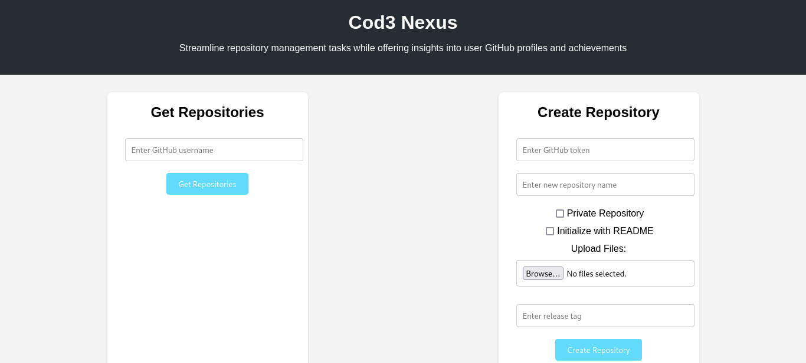

## COD3 NEXUS

Web application that allows users to create Github repositories with predefined settings & templates.

### GitHub API
Intergrate with GitHub's REST APi to programmatically create repositories using the user's GitHub account

### Template selection
Allow users to select from a list of predefined repo templates/ provides a default template

### Error handling
It displays meaningful messages if repository creation fails

### Authentication
Allows users to sign in with their Github accounts.

## Technologies
Front-end: React
Back-end: Nodejs with Express js